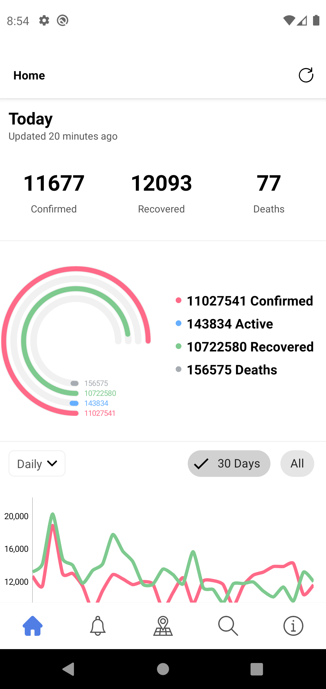

  

# covid-19
 Thanks to COVID19India.org for open-source API.

# COVID-19 Tracker Android Application
This application displays the latest updates based on numbers from https://www.covid19india.org/

## Libraries
- Kotlin
- Koin
- MVVM Architecture
- Material Design
- AndroidX
- Kotlin Coroutines
- Retrofit 2
- Moshi JSON Parser 
- Android Architecture Component

# Credits
Thanks to [COVID19India.org] (https://github.com/covid19india/api) for open-source API.

